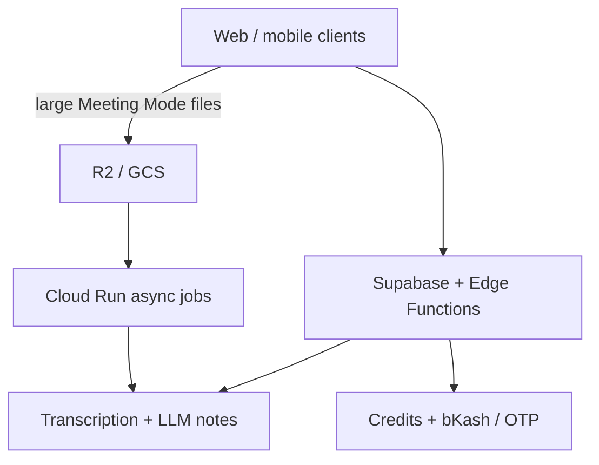

# KathaSync — Showcase

> 🔒 **Source is private** (live commercial SaaS). Happy to walk through the architecture in an interview.

Bangla / English / Banglish **voice-to-text SaaS**: record or upload audio → LLM-assisted transcription plus smart notes, summaries, meeting minutes, action items, and translation. Credit billing with **bKash SMS verification**, phone OTP, admin console, and large-file **Meeting Mode** via R2/GCS + Cloud Run async jobs.

## Overview

Bangla/English/Banglish voice-to-text SaaS with LLM-assisted notes, credit billing (bKash SMS + OTP), admin console, and Meeting Mode via R2/GCS + Cloud Run.

## Links

- **Live:** https://kathasync.com
- **This repo:** portfolio write-up only — no production source

## Role

**Founder / full-stack** — product, billing, async pipeline, and web client for the Bangladesh market.

## Key Features

- Multilingual ASR-oriented workflow (Bangla, English, Banglish)
- LLM-assisted notes, summaries, meeting minutes, action items, translation
- Credit billing with bKash SMS verification and phone OTP
- Admin console
- Meeting Mode for large files (object storage + Cloud Run async)

## Tech stack

| Layer | Stack |
| :--- | :--- |
| Frontend | React 18, TypeScript, Vite, Tailwind |
| Backend / data | Supabase, Deno Edge Functions |
| Async / media | Cloudflare R2, GCS, Cloud Run |
| Payments | bKash SMS verification |

## Dependencies

No installable source in this showcase. Product stack: React 18, TypeScript, Vite, Tailwind, Supabase, Deno Edge Functions, Cloudflare R2, Cloud Run, bKash.

## How to run locally

Source is private (commercial SaaS). Use https://kathasync.com — there is nothing to run from this repo.

## Architecture (high level)

## Screenshots

<!-- Add product screenshots under docs/screenshots/ when available -->

## Source

Production source stays private (billing, abuse controls, and commercial IP). This showcase is the public story for recruiters.
